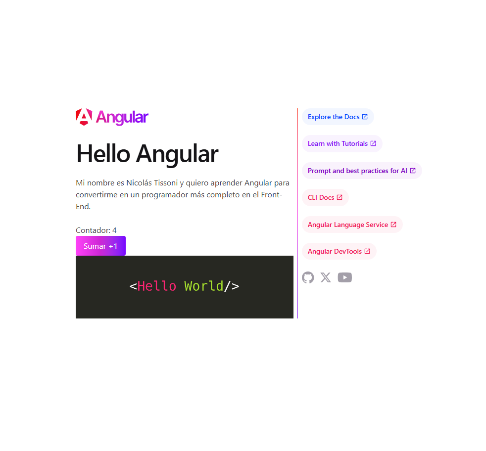

# Conociendo Angular

Proyecto correspondiente al **Módulo 1 - Unidad 1** de la Diplomatura en Desarrollo Full-Stack, cuyo objetivo es comprender el flujo básico de trabajo en Angular: desde la creación de un proyecto hasta la visualización de datos en la vista, utilizando Angular CLI.

## Funcionalidades implementadas

- Proyecto Angular generado desde cero con Angular CLI (sin routing, sin SSR).
- Modificación del título de la aplicación mediante `signal()`.
- Párrafo de presentación personal mostrado por interpolación.
- Contador interactivo (`signal` + `update()`) con botón de incremento (event binding).
- Imagen agregada desde la carpeta `public/`.
- Estilos con Tailwind CSS.

## Instalación y ejecución

Este proyecto usa **pnpm** como gestor de paquetes.

```bash
# Clonar el repositorio
git clone https://github.com/NicAT-12/Diplomatura_Full-Stack.git

# Ingresar a la carpeta del proyecto
cd "Diplomatura_Full-Stack/Desarrollo en Angular/Tarea 1 - Conociendo Angular/conociendo-angular"

# Instalar dependencias
pnpm install

# Ejecutar el servidor de desarrollo
ng serve
```

La aplicación queda disponible en `http://localhost:4200`.

## Capturas de pantalla



## Autor

- **Nombre:** Nicolás Tissoni
- **Curso:** Diplomatura en Desarrollo Full-Stack
- **Módulo / Unidad:** Módulo 1 - Unidad 1 — Conociendo Angular

## Bibliografía utilizada y sugerida

- Angular. (s.f.-a). *Welcome to the Angular tutorial*. https://angular.dev/tutorials/learn-angular
- Angular. (s.f.-b). *The Angular CLI*. https://angular.dev/tools/cli
- Angular. (s.f.-c). *Anatomy of a component*. https://angular.dev/guide/components
- Freeman, A. *Pro Angular 9*. 6ª ed. Apress; 2020.