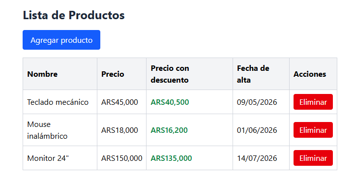
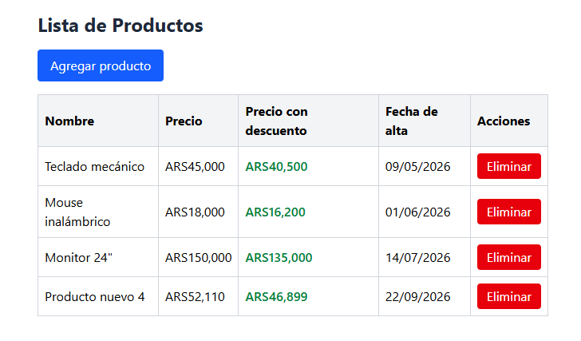
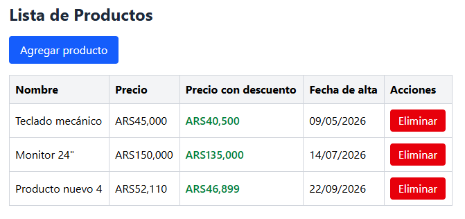

# Tarea 3 - Angular Intermedio Servicios

## Descripción breve del proyecto
Aplicación Angular que gestiona una lista de productos mediante un servicio (`ProductoService`) inyectado en el componente `ListaProductosComponent`. Los precios se muestran usando los pipes estándar `currency` y `date`, y un pipe personalizado `descuento` que calcula el precio final aplicando un porcentaje de descuento. Los estilos están implementados con **TailwindCSS**.

## Consigna de la tarea

**Módulo 1 - Unidad 3: Gestión y visualización de datos con pipes**

### Objetivos
- Aplicar el concepto de servicio en Angular para manejar datos desde una API (simulada o real).
- Utilizar pipes estándar y personalizados para transformar información antes de presentarla.

### 1. Crear un servicio
- Generar un servicio llamado `productos` utilizando Angular CLI.
- El servicio debe contener métodos para:
  - Obtener una lista de productos (`getProductos()`).
  - Agregar un producto (`addProducto()`).
  - Eliminar un producto (`deleteProducto()`).
- Los datos pueden provenir de una API pública o de un array local simulado.

### 2. Inyección en componente
- Inyectar el servicio en un componente llamado `lista-productos`.
- Usar el ciclo de vida `ngOnInit` para cargar los productos iniciales.

### 3. Pipes estándar
- Aplicar el pipe `currency` para mostrar precios.
- Aplicar el pipe `date` para mostrar una fecha de alta de cada producto.

### 4. Pipe personalizado
- Crear un pipe llamado `descuento` que reciba el precio de un producto y un porcentaje y devuelva su precio final.
- Aplicar el pipe en la vista para mostrar el precio con descuento.

### 5. Interacción
- Agregar botones para:
  - Eliminar un producto.
  - Simular agregar un producto nuevo.
- Mostrar un mensaje si la lista está vacía usando `*ngIf`.

## Instrucciones para clonar, instalar y ejecutar

```bash
git clone https://github.com/NicAT-12/Diplomatura_Full-Stack.git
cd "Diplomatura_Full-Stack/Desarrollo en Angular/Tarea 3 - Angular intermedio. Servicios"
npm install
ng serve
```

Luego abrir el navegador en `http://localhost:4200`.

## Estructura principal

- `src/app/models/producto.model.ts` — interfaz `Producto`.
- `src/app/services/producto.service.ts` — servicio con `getProductos()`, `addProducto()` y `deleteProducto()`.
- `src/app/pipes/descuento.pipe.ts` — pipe personalizado que recibe un precio y un porcentaje, y devuelve el precio con descuento aplicado.
- `src/app/components/lista-productos/` — componente que inyecta el servicio, carga los productos en `ngOnInit`, y muestra la lista con los pipes `currency`, `date` y `descuento`.

## Funcionalidad implementada

- Carga inicial de productos desde el servicio al iniciar el componente (`ngOnInit`).
- Botón para simular el agregado de un nuevo producto (`addProducto`).
- Botón para eliminar un producto de la lista (`deleteProducto`).
- Mensaje "No hay productos cargados." mostrado con `*ngIf` cuando la lista está vacía.
- Precios mostrados con el pipe `currency` y fechas con el pipe `date`.
- Precio final con descuento mostrado usando el pipe personalizado `descuento`.

## Capturas de pantalla

### Lista de productos con pipes estándar y personalizado


### Agregar producto


### Eliminar producto


## Créditos del autor
- Nombre: Nicolás Tissoni
- Curso: Diplomatura Full-Stack
- Unidad: Módulo 1 - Unidad 3, Angular intermedio. Servicios

## Bibliografía utilizada

### Libros y otros manuscritos
Freeman, A. Pro Angular 9. 6ª ed. Apress; 2020.

### Artículos y documentación en línea
Angular. (s.f.-a). Understanding dependency injection. https://angular.dev/guide/di/dependency-injection

Angular. (s.f.-b). Welcome to the Angular tutorial. https://angular.dev/tutorials/learn-angular

Angular. (s.f.-c). What is Angular? https://angular.dev/overview
