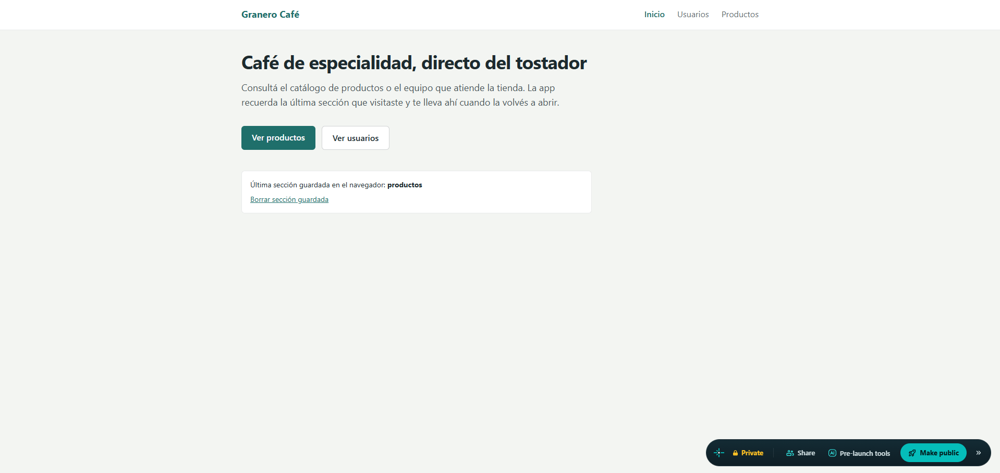
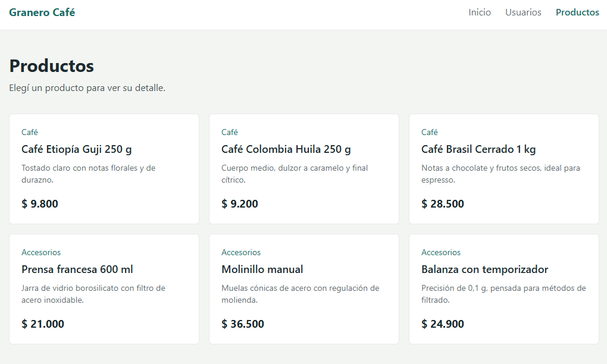
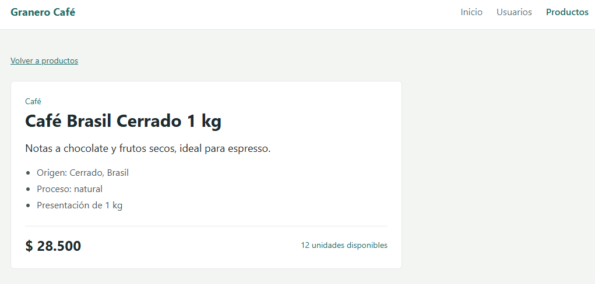
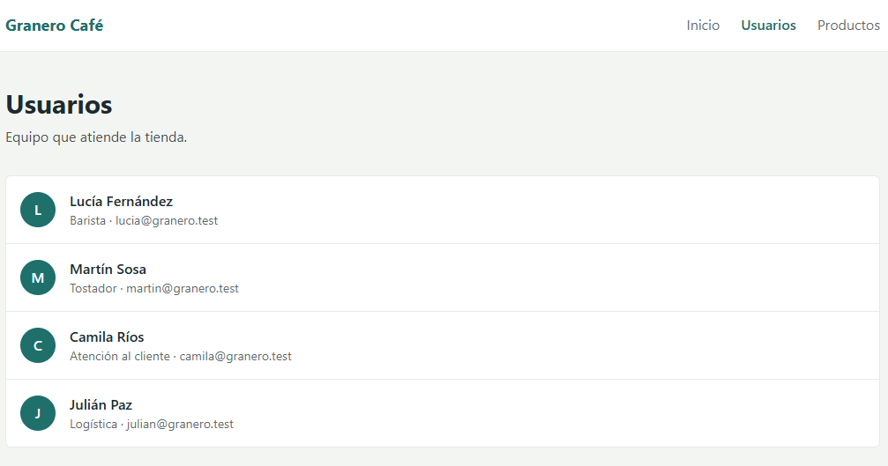

# Granero Café: aplicación modular con rutas y almacenamiento en navegador

Aplicación Angular con módulos de funcionalidad (`UsuariosModule` y `ProductosModule`) cargados de forma perezosa (lazy loading), una ruta dinámica `/productos/:id` y persistencia de la última sección visitada en `localStorage`. Estilos con TailwindCSS.

## Funcionalidades

- `AppModule` con `AppRoutingModule`; cada módulo de funcionalidad tiene su propio módulo de rutas.
- `/` → inicio, `/usuarios` → `UsuariosModule` (lazy), `/productos` → `ProductosModule` (lazy).
- Ruta dinámica `/productos/:id` con el detalle de cada producto.
- Navegación con `routerLink` y `<router-outlet />`.
- La última sección visitada se guarda en `localStorage` (clave `ultima-seccion`). Al abrir o recargar la app en `/`, un guard redirige a esa sección.

## Instalación y ejecución

```bash
git clone https://github.com/NicAT-12/Diplomatura_Full-Stack.git
cd "Diplomatura_Full-Stack/Desarrollo en Angular/Tarea 4 - Angular Avanzado Routing"
npm install
ng serve
```

Abrir `http://localhost:4200`.

## Build de producción

```bash
ng build --configuration production
```

## Despliegue

- Plataforma: Netlify
- Enlace: https://strong-zuccutto-f0875e.netlify.app/
- El archivo `netlify.toml` incluye la regla de reescritura a `index.html` para que las rutas internas funcionen al recargar.

## Capturas de pantalla

| Vista | Captura |
| --- | --- |
| Inicio |  |
| Lista de productos |  |
| Detalle dinámico (`/productos/3`) |  |
| Usuarios |  |

## Autor

- Nombre: Nicolas Tissoni
- Curso: Diplomatura Full Stack
- Unidad: Módulo 1, Unidad 4: Angular avanzado. Routing

## Bibliografía y créditos

- Freeman, A. (2020). *Pro Angular 9* (6.ª ed.). Apress.
- Angular. (s.f.). *Other common Routing Tasks*. https://angular.dev/guide/routing/common-router-tasks
- Angular. (s.f.). *NgModules*. https://angular.dev/guide/ngmodules/overview
- Angular. (s.f.). *Deployment*. https://angular.dev/tools/cli/deployment
- MDN Web Docs. (s.f.). *Window: localStorage property*. Mozilla Corporation. https://developer.mozilla.org/en-US/docs/Web/API/Window/localStorage
- MDN Web Docs. (s.f.). *Window: sessionStorage property*. Mozilla Corporation. https://developer.mozilla.org/en-US/docs/Web/API/Window/sessionStorage
- Tailwind CSS. (s.f.). *Install Tailwind CSS with Angular*. https://tailwindcss.com/docs/installation/framework-guides/angular

La aplicación no usa imágenes de terceros; los datos de usuarios y productos son ficticios.
