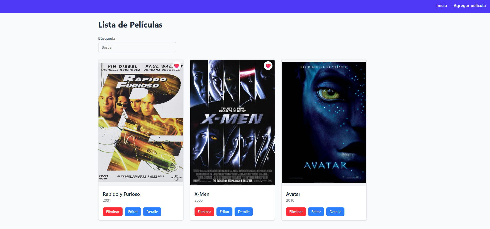
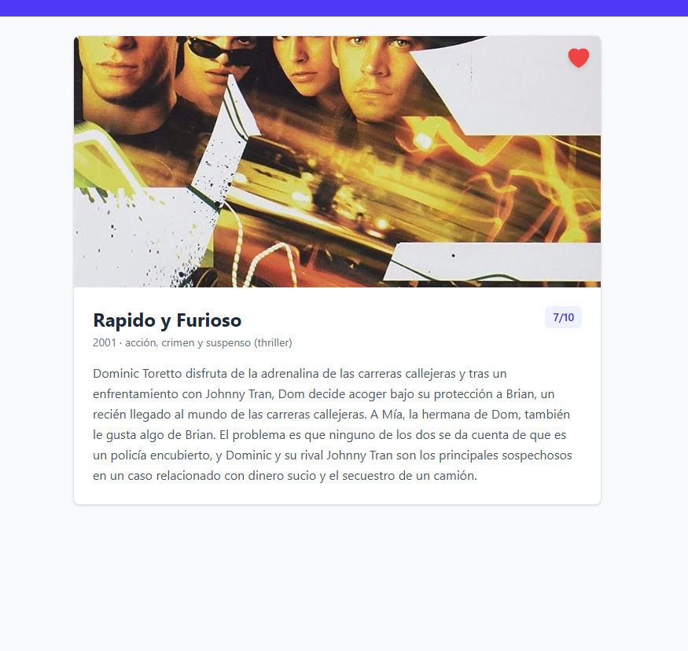
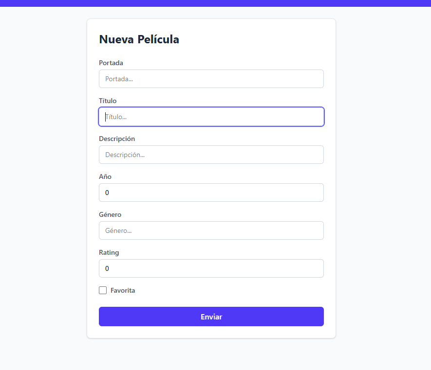
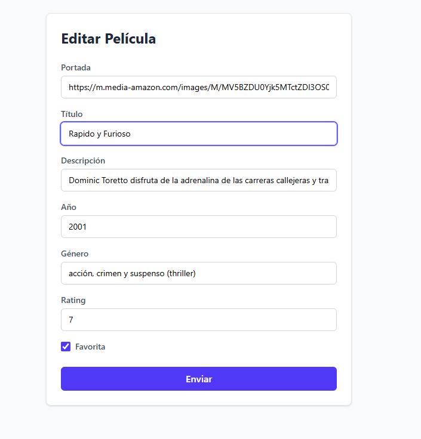

# 🎬 Mis Películas Favoritas

Aplicación web CRUD para gestionar una colección de películas favoritas, desarrollada como Trabajo Integrador Final de la Diplomatura Full-Stack (UTN).

Permite visualizar, buscar, agregar, editar y eliminar películas, además de marcarlas como favoritas y consultar el detalle de cada una. Los datos se almacenan y sincronizan con **Firebase Firestore**.

## ✨ Funcionalidades

- Listado de todas las películas almacenadas.
- Búsqueda de películas por título (filtrado en tiempo real con `useMemo`).
- Alta de nuevas películas mediante formulario controlado.
- Edición de películas existentes.
- Eliminación de películas, con confirmación previa del usuario.
- Marcado y desmarcado de películas como favoritas.
- Página de detalle individual para cada película.
- Indicadores de carga durante las operaciones asíncronas.
- Manejo de errores visible para el usuario (carga, guardado y eliminación).
- Página 404 para rutas inexistentes.

## 🛠️ Tecnologías utilizadas

- [React 19](https://react.dev/)
- [Vite](https://vite.dev/)
- [React Router v7](https://reactrouter.com/)
- [Firebase Firestore](https://firebase.google.com/docs/firestore)
- [Tailwind CSS 4](https://tailwindcss.com/)
- [pnpm](https://pnpm.io/) como gestor de paquetes

## 📁 Estructura del proyecto

```
src/
├── components/    # Componentes reutilizables (ej. NavBar)
├── views/         # Vistas/páginas (Lista, Formulario, Detalle, 404)
├── services/      # Comunicación con Firebase Firestore
├── validators/    # Validación de datos del formulario
├── router/        # Configuración de rutas y layout
└── config/        # Configuración de Firebase
```

## 🔑 Variables de entorno

El proyecto utiliza variables de entorno para la configuración de Firebase. Creá un archivo `.env` en la raíz del proyecto con las siguientes claves:

```
VITE_FIREBASE_API_KEY=
VITE_FIREBASE_AUTH_DOMAIN=
VITE_FIREBASE_PROJECT_ID=
VITE_FIREBASE_STORAGE_BUCKET=
VITE_FIREBASE_MESSAGING_SENDER_ID=
VITE_FIREBASE_APP_ID=
```

Estos valores se obtienen desde la configuración de tu proyecto en la [consola de Firebase](https://console.firebase.google.com/).

## 🚀 Instalación y ejecución

1. Cloná el repositorio y ubicate en la carpeta del proyecto:

   ```bash
   git clone https://github.com/NicAT-12/Diplomatura_Full-Stack.git
   cd "Diplomatura_Full-Stack/Trabajo Integrador Final"
   ```

2. Instalá las dependencias con `pnpm`:

   ```bash
   pnpm install
   ```

3. Creá el archivo `.env` en la raíz del proyecto con tus credenciales de Firebase (ver sección anterior).

4. Iniciá el servidor de desarrollo:

   ```bash
   pnpm dev
   ```

5. Abrí [http://localhost:5173](http://localhost:5173) en tu navegador.

### Otros comandos disponibles

```bash
pnpm build     # Genera la build de producción
pnpm preview   # Sirve la build de producción localmente
pnpm lint      # Ejecuta ESLint sobre el proyecto
```

## 📸 Capturas de pantalla

### Listado de películas


### Detalle de película


### Formulario


### Formulario Editar


## 📚 Bibliografía

- [Documentación oficial de React](https://react.dev/)
- [Documentación oficial de Vite](https://vite.dev/)
- [Documentación oficial de React Router](https://reactrouter.com/)
- [Documentación oficial de Firebase Firestore](https://firebase.google.com/docs/firestore)
- [Documentación oficial de Tailwind CSS](https://tailwindcss.com/docs)
- [Documentación oficial de pnpm](https://pnpm.io/motivation)

## 👤 Autor

**Nicolás Tissoni**
GitHub: [@NicAT-12](https://github.com/NicAT-12)
