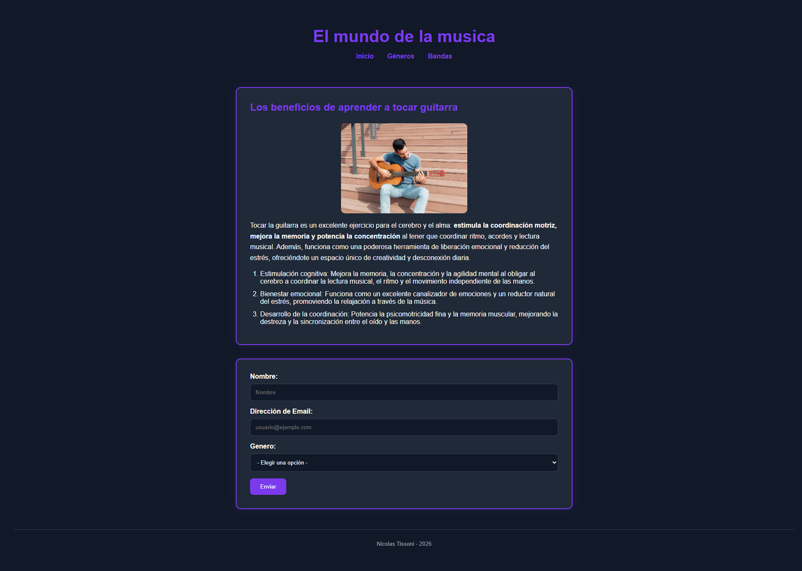

# El Mundo de la Música

## Descripción

El Mundo de la Música es una página web desarrollada utilizando HTML5 y CSS3 como práctica de estructura semántica y estilos básicos. El sitio presenta información sobre los beneficios de aprender a tocar guitarra e incluye un formulario para que los usuarios indiquen sus preferencias musicales.

## Tecnologías utilizadas

* HTML5
* CSS3

## Características

* Estructura semántica utilizando:

  * Header
  * Main
  * Article
  * Footer
* Menú de navegación.
* Imagen con texto alternativo descriptivo.
* Lista ordenada informativa.
* Formulario con campos de texto, email y selección de género musical.
* Variables CSS para colores y tipografía.
* Efectos hover en los enlaces de navegación.
* Diseño responsivo básico.

## Instalación y ejecución

### Clonar el repositorio

```bash
git clone https://github.com/NicAT-12/html-css_el-mundo-de-la-musica.git
```

### Abrir el proyecto

1. Ingresar a la carpeta del proyecto.
2. Abrir el archivo `index.html` en cualquier navegador web.

## Captura de pantalla



## Estructura del proyecto

```text
html-css_el-mundo-de-la-musica/
│
├── assets/
│   ├── hombre-tocando-guitarra.avif
│   └── captura.png
│
├── index.html
├── styles.css
└── README.md
```

## Autor

**Nicolas Tissoni**

Diplomatura Full-Stack
Tarea 1 - Antes de React

## Bibliografía y fuentes consultadas

* MDN Web Docs - HTML
  https://developer.mozilla.org/en-US/docs/Web/HTML

* MDN Web Docs - CSS
  https://developer.mozilla.org/en-US/docs/Web/CSS

* WHATWG HTML Living Standard
  https://html.spec.whatwg.org/

## Créditos de imágenes

Imagen principal utilizada con fines educativos para la realización de la actividad académica.

Fuente:

https://www.magnific.com/es/foto-gratis/vista-frontal-hombre-tocando-guitarra_10887636.htm#fromView=keyword&page=1&position=3&uuid=1a89fa07-05e0-44c4-822c-580202de2c52&query=Persona+tocando+guitarra
