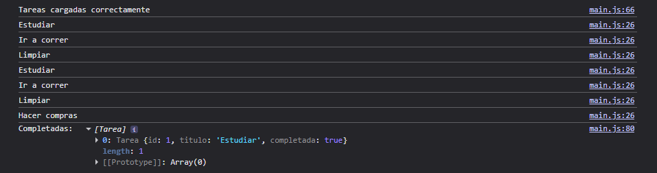

# Gestor de Tareas - JavaScript Avanzado

Proyecto realizado para practicar JavaScript avanzado mediante clases, promesas, asincronía y métodos de arrays.

## Objetivos

- Crear clases con propiedades y métodos.
- Simular asincronía con Promise y setTimeout.
- Usar async/await.
- Manipular arrays con forEach, find y filter.

## Instalación y ejecución

1. Clonar el repositorio:

```bash
git clone URL_DEL_REPOSITORIO

## Capturas de pantalla

### Ejecución del programa

Agregar aquí las capturas de la consola mostrando:

- Carga inicial de tareas.
- Agregado de una nueva tarea.
- Listado de tareas completadas.

Ejemplo:



## Autor

Desarrollado por Nicolas Tissoni.

GitHub: https://github.com/NicAT-12

## Bibliografía y fuentes

### Documentación

- MDN Web Docs - Classes:
  https://developer.mozilla.org/en-US/docs/Web/JavaScript/Reference/Classes

- MDN Web Docs - Promise:
  https://developer.mozilla.org/en-US/docs/Web/JavaScript/Reference/Global_Objects/Promise

- MDN Web Docs - Array:
  https://developer.mozilla.org/en-US/docs/Web/JavaScript/Reference/Global_Objects/Array

### Material de estudio

- Flanagan, David. JavaScript: The Definitive Guide. 7th Edition. O'Reilly Media, 2020.

- Freeman, Eric y Robson, Elisabeth. Head First JavaScript Programming. O'Reilly Media, 2014.