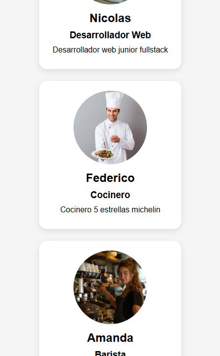

# React Inicial - Tarjetas de Presentación

## Descripción

Proyecto realizado con React y Vite como parte de una práctica inicial de React.

La aplicación consiste en un componente reutilizable llamado **Tarjeta**, el cual recibe información mediante props y muestra una tarjeta de presentación con imagen, nombre, profesión y descripción.

## Consigna

Implementar un componente `Tarjeta.jsx` que reciba las siguientes props:

* nombre
* profesion
* imagen
* descripcion

Dentro del componente se debe mostrar:

* Un elemento `` con atributo `alt`
* Un elemento `<h2>` para el nombre
* Un elemento `<h3>` para la profesión
* Un elemento `<p>` para la descripción

Desde `App.jsx` se renderizan tres tarjetas utilizando el mismo componente y enviando distintos datos mediante props.

## Tecnologías Utilizadas

* React
* Vite
* JavaScript
* CSS

## Instalación

Clonar el repositorio:

```bash
git clone https://github.com/NicAT-12/React-Inicial_Tarjetas-de-Presentacion.git
```

Ingresar al directorio del proyecto:

```bash
cd React-Inicial_Tarjetas-de-Presentacion
```

Instalar dependencias:

```bash
pnpm install
```

## Ejecución

Iniciar el servidor de desarrollo:

```bash
pnpm dev
```

Luego abrir en el navegador la URL proporcionada por Vite.

## Nota sobre el gestor de paquetes

La consigna original proponía utilizar NPM. Para este proyecto se utilizó PNPM como gestor de paquetes, manteniendo la misma funcionalidad y flujo de trabajo requerido por la actividad.

## Capturas de Pantalla

### Vista Escritorio


### Vista Responsive



## Estructura de Recursos

Las imágenes utilizadas por la aplicación se encuentran almacenadas localmente dentro de:

```text
src/assets
```

## Créditos y Fuentes

### Imágenes

* Barista: https://stockcake.com/es/i/barista-preparando-caf%C3%A9_985888_533034
* Desarrollador Web: https://www.utb.edu.co/blog/noticias/sabes-cual-debe-ser-el-perfil-de-un-programador/
* Cocinero: https://blog.europa.jobs/es/art-cuanto-gana-un-cocinero-en-el-extranjero/

### Documentación Consultada

* React Documentation
* Vite Documentation

## Autor

Nicolás Tissoni

## Repositorio

https://github.com/NicAT-12/React-Inicial_Tarjetas-de-Presentacion
