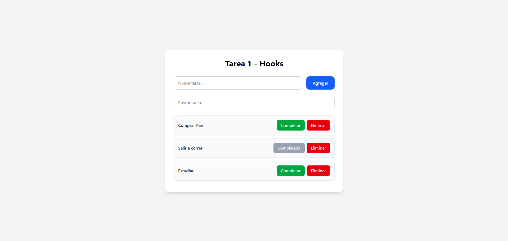

# Task App — React + Hooks

Aplicación de gestión de tareas desarrollada con React, utilizando Hooks para el manejo del estado y lógica de la aplicación. Permite crear, completar y eliminar tareas, con persistencia de datos en el navegador mediante `localStorage`.

---

## Tecnologías utilizadas

| Tecnología | Descripción |
|---|---|
| [React](https://react.dev/) | Biblioteca principal de UI |
| React Hooks | `useState`, `useEffect`, `useCallback`, hook personalizado |
| [TailwindCSS](https://tailwindcss.com/) | Estilos y diseño responsive |
| localStorage | Persistencia de datos en el navegador |
| PropTypes | Validación de props en componentes |

---

## Funcionalidades

- Crear tareas con validación de campos vacíos y duplicados
- Marcar tareas como completadas o pendientes
- Eliminar tareas individualmente
- Buscar tareas en tiempo real por nombre
- Persistencia automática con `localStorage` (los datos se mantienen al recargar)
- Diseño responsive adaptado a dispositivos móviles y de escritorio

---

## Captura de pantalla



---

## Custom Hook

### `useLocalStorage(key, initialValue)`

Hook personalizado que sincroniza el estado de React con `localStorage` de forma automática.

```js
const [tasks, setTasks] = useLocalStorage('tasks', []);
```

Internamente utiliza `useState` y `useEffect` para mantener el estado sincronizado con el almacenamiento del navegador sin necesidad de lógica repetida en cada componente.

---

## Estructura del proyecto

```
src/
├── components/
│   ├── TaskForm.jsx       # Formulario para agregar tareas
│   ├── SearchBar.jsx      # Barra de búsqueda
│   ├── TaskList.jsx       # Lista de tareas filtradas
│   └── TaskItem.jsx       # Ítem individual de tarea
├── hooks/
│   └── useLocalStorage.jsx  # Hook personalizado de persistencia
├── App.jsx                # Componente raíz y estado global
├── main.jsx               # Punto de entrada
└── index.css              # Estilos globales
```

---

## Instalación y uso

### Prerrequisitos

- Node.js >= 18
- pnpm (recomendado) o npm

### Pasos

```bash
# 1. Clonar el repositorio
git clone https://github.com/NicAT-12/Diplomatura_Full-Stack.git
cd "Diplomatura_Full-Stack/Modulo 2/Tarea 1 - Hooks"

# 2. Instalar dependencias
pnpm install

# 3. Iniciar el servidor de desarrollo
pnpm dev
```

Abrí [http://localhost:5173](http://localhost:5173) en tu navegador.

### Scripts disponibles

| Comando | Descripción |
|---|---|
| `pnpm dev` | Inicia el servidor de desarrollo |
| `pnpm build` | Genera el build de producción en `/dist` |
| `pnpm preview` | Previsualiza el build de producción localmente |

---

## Consigna

> **Módulo 2 — Tarea 1**  
> Desarrollar una aplicación de tareas utilizando React Hooks. La app debe incluir:
> - Gestión de estado con `useState` y `useEffect`
> - Al menos un custom hook
> - Persistencia con `localStorage`
> - Búsqueda y filtrado de tareas
> - Validaciones de formulario
> - Validación de props con `PropTypes`
> - Diseño responsive

---

## Autor

**Nicolas** — [UTN · Diplomatura Full-Stack Web Development](https://www.utn.edu.ar/)  
Repositorio: [Diplomatura_Full-Stack](https://github.com/NicAT-12/Diplomatura_Full-Stack)
