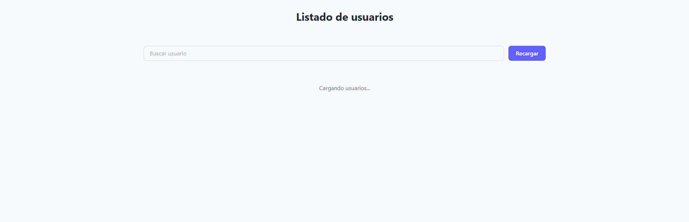
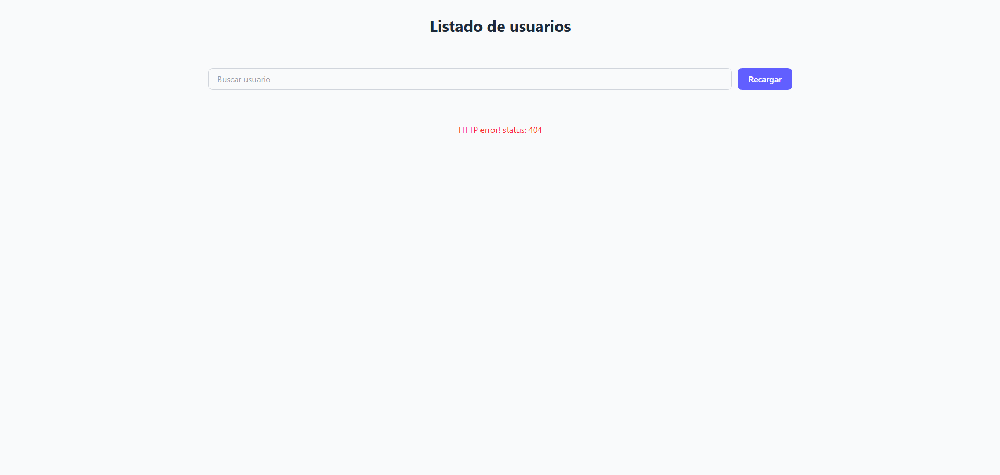
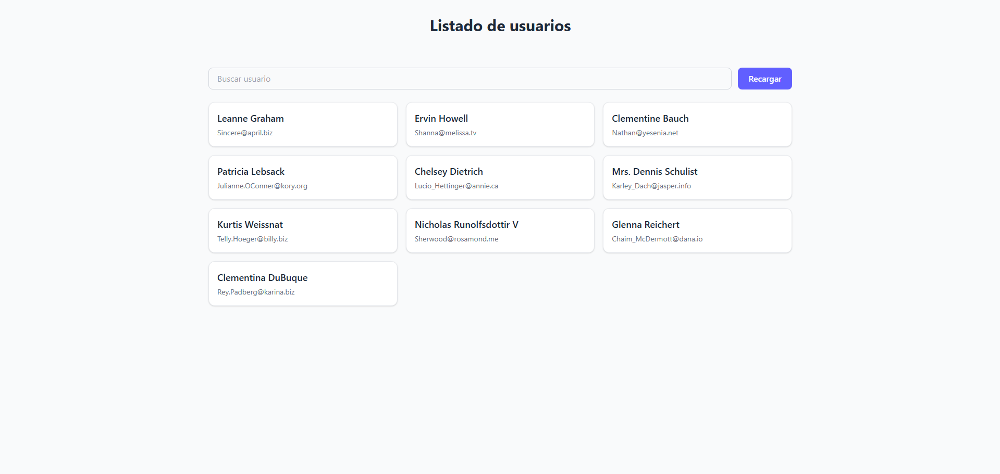

# Listado de Usuarios - API REST en React

## Descripción del proyecto

Aplicación desarrollada en React (con Vite) que consume la API pública [JSONPlaceholder](https://jsonplaceholder.typicode.com/users) para mostrar un listado de usuarios. El proyecto implementa manejo de estados de carga, error y datos, renderizado condicional, un buscador por nombre y un botón para recargar la información. Los estilos fueron implementados con TailwindCSS.

### Funcionalidades principales

- Consumo de la API REST mediante `fetch` con `async/await`.
- Manejo de estados `usuarios`, `loading` y `error` con `useState`.
- Solicitud a la API dentro de `useEffect`, con validación de `res.ok` y manejo de errores mediante `try/catch`.
- Renderizado condicional según el estado de la aplicación (cargando, error, datos, sin resultados).
- Barra de búsqueda que filtra usuarios por nombre en tiempo real.
- Botón "Recargar" para volver a solicitar los datos a la API.
- Componente `Usuarios.jsx` como contenedor principal y `UsuarioCard.jsx` como componente hijo para cada tarjeta de usuario.

## Tecnologías utilizadas

- [React](https://react.dev/) (creado con [Vite](https://vitejs.dev/))
- [TailwindCSS](https://tailwindcss.com/)
- [pnpm](https://pnpm.io/) como gestor de paquetes

## Instalación y ejecución

Clonar el repositorio:

```bash
git clone https://github.com/NicAT-12/Diplomatura_Full-Stack.git
cd Diplomatura_Full-Stack
```

Instalar las dependencias:

```bash
pnpm install
```

Ejecutar el proyecto en modo desarrollo:

```bash
pnpm run dev
```

La aplicación quedará disponible en la URL que indique la consola (por defecto `http://localhost:5173`).

## Capturas de pantalla

### Estado: Cargando usuarios



### Estado: Error



### Estado: Datos cargados



## Autor

- **Nombre:** Nicolás Tissoni
- **Diplomatura:** Diplomatura en Desarrollo Full-Stack
- **Módulo/Unidad:** Módulo 2 - Unidad 2

## Bibliografía utilizada y sugerida

### Libros y otros manuscritos

- Banks, A. y Porcello, E. *Learning React: Modern Patterns for Developing React Apps.* 2ª ed. O'Reilly Media; 2020.
- Flanagan, D. *JavaScript: The Definitive Guide. Master the World's Most-Used Programming Language.* 7ª ed. Estados Unidos: O'Reilly Media; 2020. https://share.google/NWtI0mj2jOuHpwbuu

### Artículos y documentación en línea

- MDN Web Docs. (s.f.). *Window: fetch() method.* Mozilla Corporation. https://developer.mozilla.org/en-US/docs/Web/API/fetch
- React. (s.f.-a). *useState Hook.* https://react.dev/reference/react/useState
- React. (s.f.-b). *useEffect Hook.* https://react.dev/reference/react/useEffect
