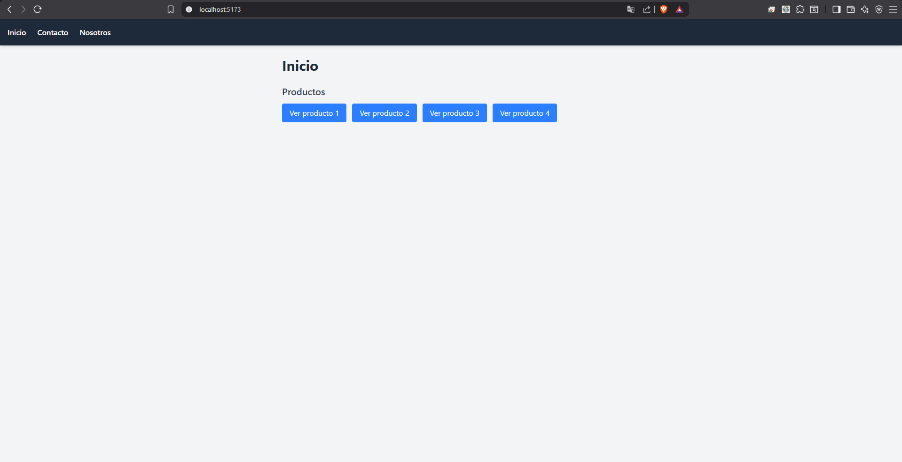
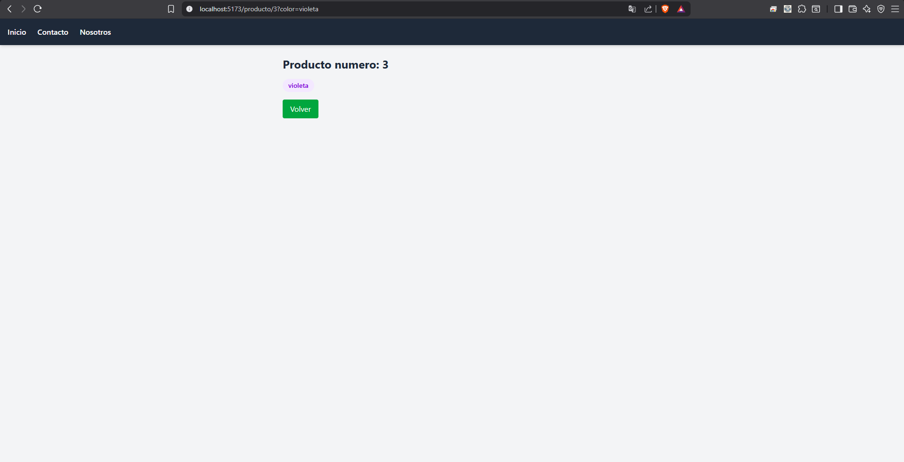
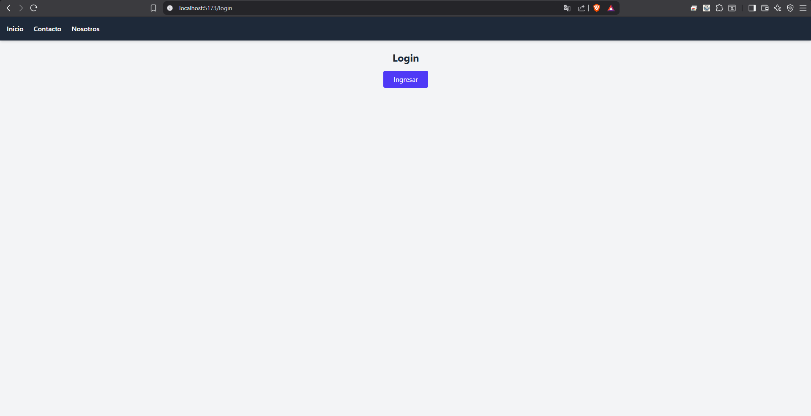

# Mini Dashboard - Rutas Públicas y Protegidas

## Descripción

Este proyecto es un mini dashboard desarrollado con **React** y **React Router**, creado como práctica de enrutamiento. Incluye rutas estáticas, una ruta dinámica con parámetros, manejo de query params, navegación programática, rutas anidadas mediante un layout compartido, y una ruta protegida que simula un flujo de login con redirección post-autenticación.

## Tecnologías utilizadas

- React (Vite)
- React Router DOM
- Tailwind CSS
- PropTypes

## Instalación y ejecución

Cloná el repositorio y ejecutá los siguientes comandos:

```bash
git clone https://github.com/NicAT-12/Diplomatura_Full-Stack.git
cd Diplomatura_Full-Stack/Modulo\ 2/Tarea\ 3\ -\ Enrutamiento
npm install
npm run dev
```

La aplicación va a estar disponible en `http://localhost:5173` (o el puerto que indique la terminal).

## Funcionalidades

- **Rutas estáticas:** Inicio, Nosotros y Contacto.
- **Navegación declarativa:** enlaces con `<Link>` ubicados en un layout de navegación fija.
- **Ruta dinámica:** página de Producto (`/producto/:id`) que recibe un identificador por `useParams`.
- **Query params:** cada producto puede recibir un color mediante `?color=...`, leído con `useSearchParams`.
- **Navegación programática:** botón "Volver" en Producto, implementado con `useNavigate`.
- **Rutas anidadas:** un `Layout` con `<Outlet />` contiene la navegación fija y renderiza la página activa según la URL.
- **Ruta protegida:** el acceso a Producto requiere estar "logueado" (simulado con estado). Si no lo está, se redirige a Login y, tras ingresar, se vuelve automáticamente a la página que se quería visitar originalmente (incluyendo sus query params).

## Capturas de pantalla

### Página estática (Inicio)


### Página dinámica (Producto)


### Ruta protegida (Login)


## Créditos

- **Autor:** Nicolas Tissoni
- **Curso:** Diplomatura Full Stack
- **Unidad:** Módulo 2 - Unidad 3 - Enrutamiento

## Bibliografía utilizada y sugerida

### Libros y otros manuscritos

Abramov, D. y Clark, A. *Fullstack React: The Complete Guide to ReactJS and Friends*. 1ª ed. Accomazzo LLC; 2017.

Banks, A. y Porcello, E. *Learning React: Modern Patterns for Developing React Apps*. 2ª ed. O'Reilly Media; 2020.

### Artículos y documentación en línea

MDN Web Docs. (s.f.). *URLSearchParams*. Mozilla Corporation. https://developer.mozilla.org/en-US/docs/Web/API/URLSearchParams

React Router. (s.f.). *Tutorial*. https://reactrouter.com/en/main/start/tutorial

React Router API Reference. *Function useNavigate*. https://reactrouter.com/en/main/hooks/use-navigate
