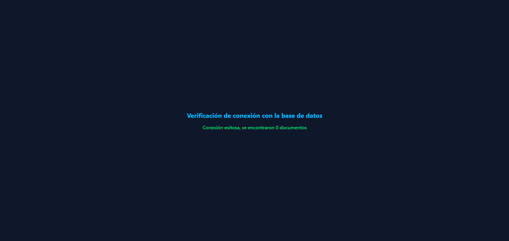

# Módulo 3 | Tarea 1 - Firebase Parte 1

## Consigna

**Conectando mi primera app React con Firebase**

**Objetivo:** Comprender el flujo completo para integrar Firebase en un
proyecto React, desde la creación del proyecto en la consola hasta su
conexión con el frontend, aplicando buenas prácticas.

1. **Acceso a la consola.**
   - Ingresar a Firebase Console.
   - Crear un proyecto nuevo con un nombre identificable.
   - Decidir si se activarán Google Analytics o no.

2. **Vinculación con una aplicación web.**
   - Seleccionar la opción de añadir una app Web.
   - Asignarle un nombre y obtener el objeto de configuración que genera
     Firebase.
   - Guardar este objeto en un lugar seguro.

3. **Preparar el proyecto React.**
   - Crear un proyecto con Vite o CRA.
   - Instalar el SDK de Firebase.
   - Crear un archivo de configuración dedicado a Firebase.

4. **Buenas prácticas.**
   - Usar variables de entorno para guardar las claves de configuración.
   - Asegurarse de que la inicialización de Firebase se haga una sola vez.
   - Importar sólo los módulos que realmente se van a utilizar.

5. **Prueba de conexión.**
   - Realizar una verificación simple desde el frontend para confirmar que
     Firebase esté correctamente vinculado.
   - Comentar los pasos ejecutados y los posibles errores que hayan surgido
     en el proceso.

**Formato de presentación:** entrega a través de un repositorio en GitHub
que incluya el proyecto en React, el archivo de configuración de Firebase,
uso de variables de entorno, importación selectiva de módulos, y un
`README.md` con descripción, instrucciones de instalación, capturas,
problemas comunes y su resolución, créditos y bibliografía.

## Descripción del proyecto

Este proyecto es una aplicación React (creada con Vite) que se conecta a
Firebase para verificar que la vinculación entre el frontend y el backend
gestionado por Firebase (Firestore) funcione correctamente.

El proceso de integración incluyó:

1. Creación del proyecto `Diplomatura-Full-Stack` en Firebase Console (sin
   Google Analytics).
2. Registro de una app web dentro de ese proyecto, llamada
   `Tarea 1 - Firebase parte 1`.
3. Instalación del SDK de Firebase (`firebase`) en el proyecto React con
   `pnpm`.
4. Creación de un archivo de configuración centralizado
   (`src/firebase/config.js`) que inicializa la app una sola vez y expone
   la instancia de Firestore (`db`).
5. Uso de variables de entorno (`.env`, con prefijo `VITE_`) para proteger
   las credenciales de Firebase, excluyendo el archivo del repositorio
   mediante `.gitignore`.
6. Verificación real de la conexión desde el frontend (`App.jsx`),
   realizando una consulta a Firestore con `getDocs` y mostrando en
   pantalla si la conexión fue exitosa o si ocurrió un error.

## Instalación y ejecución

Cloná el repositorio:

```bash
git clone https://github.com/NicAT-12/Diplomatura_Full-Stack.git
cd "Diplomatura_Full-Stack/Modulo 3/Tarea 1 - Firebase Parte 1"
```

Instalá las dependencias:

```bash
pnpm install
```

Creá un archivo `.env` en la raíz del proyecto con tus propias credenciales
de Firebase (ver los nombres de variables usados en
`src/firebase/config.js`):

```
VITE_FIREBASE_API_KEY=
VITE_FIREBASE_AUTH_DOMAIN=
VITE_FIREBASE_PROJECT_ID=
VITE_FIREBASE_STORAGE_BUCKET=
VITE_FIREBASE_MESSAGING_SENDER_ID=
VITE_FIREBASE_APP_ID=
```

Ejecutá el proyecto en modo desarrollo:

```bash
pnpm run dev
```

## Verificación de conexión

Al iniciar la app, se realiza automáticamente una consulta a la colección
`test` de Firestore. Según el resultado, se muestra uno de estos mensajes
en pantalla:

- **Cargando...** mientras se resuelve la consulta.
- **Conexión exitosa, se encontraron X documentos** si la consulta se
  realizó correctamente.
- El **mensaje de error** correspondiente si algo falla.

### Captura de la conexión exitosa



## Problemas encontrados y solución

Durante la verificación de conexión surgió el error:

```
Missing or insufficient permissions.
```

Este error no estaba relacionado con las credenciales de configuración
(`apiKey`, `projectId`, etc.), sino con las **reglas de seguridad de
Firestore**. Firestore Database se había creado en modo de prueba (que
permite lectura y escritura sin restricciones durante un período limitado),
pero la conexión seguía fallando hasta confirmar correctamente la
publicación de las reglas desde la consola de Firebase. Tras eso y recargar
la aplicación, la conexión se estableció con éxito.

Esto confirmó la utilidad de probar la conexión con una consulta real a
Firestore (`getDocs`) en lugar de únicamente `initializeApp()`, ya que este
último no genera errores aunque existan problemas de permisos o
configuración, mientras que una consulta real sí los revela.

## Créditos

- **Autor:** Nicolás Tissoni
- **Módulo:** Módulo 3
- **Unidad:** Unidad 1 - Firebase. Parte 1

## Bibliografía y documentación oficial

- Google for Developers. (s.f.). *Agrega Firebase al proyecto de
  JavaScript*. Firebase. https://firebase.google.com/docs/web/setup
- Vite. (s.f.). *Env Variables and Modes*.
  https://vitejs.dev/guide/env-and-mode.html