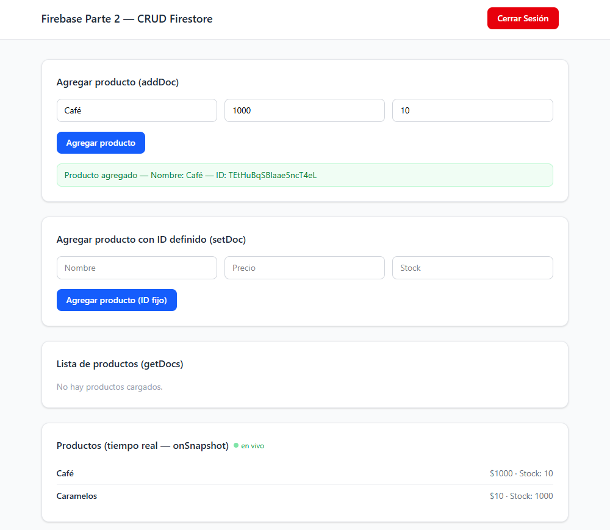
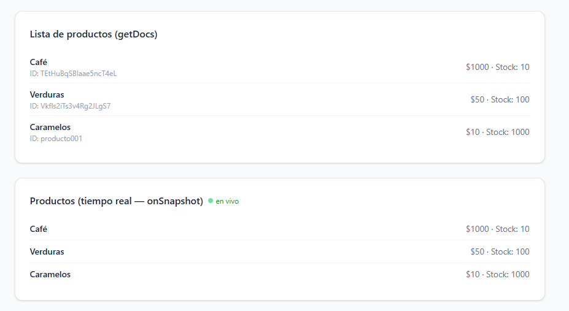
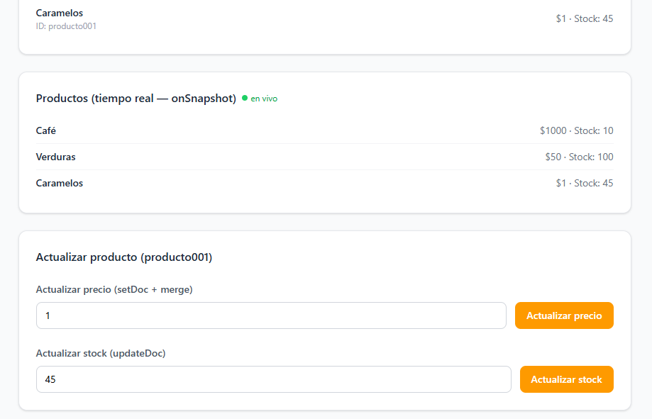
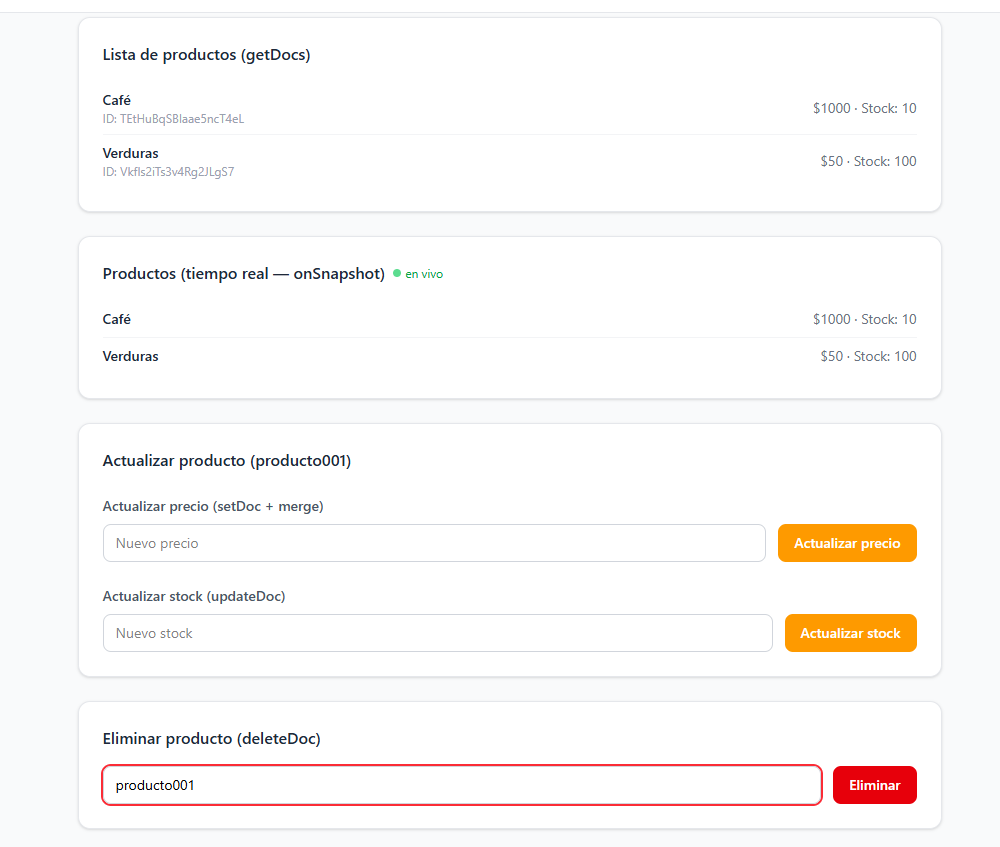
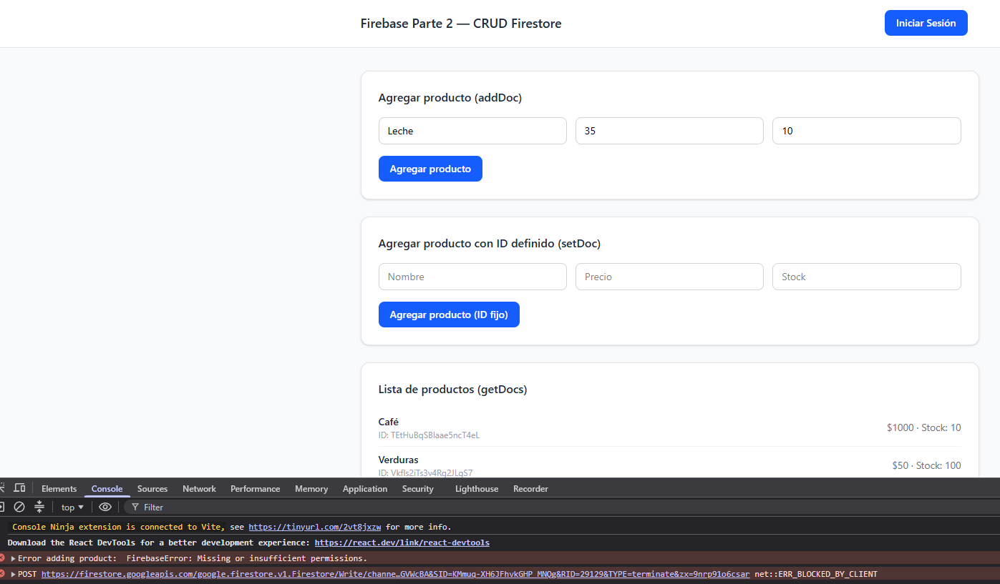

# Firebase Parte 2 — Mi primer CRUD en Firestore

**Diplomatura Full-Stack — Módulo 3, Unidad 2**
**Autor:** Nicolas Tissoni

## Descripción del proyecto

Aplicación desarrollada en **React (Vite)** conectada a **Firebase Firestore**, que implementa las cuatro operaciones CRUD (Crear, Leer, Actualizar, Eliminar) sobre una colección de productos, junto con lecturas en tiempo real y reglas de seguridad basadas en autenticación.

Además de lo pedido en la consigna, el proyecto incluye:

- **Autenticación anónima con Firebase Authentication** (`Login.jsx`), para poder probar las reglas de seguridad de escritura.
- **Estilos con TailwindCSS**, aplicados a todos los componentes para una interfaz más clara y usable.

### Explicación de cada operación CRUD

| Operación | Componente | Función de Firestore | Descripción |
|---|---|---|---|
| Crear (ID automático) | `AgregarProducto.jsx` | `addDoc` | Inserta un producto nuevo dejando que Firestore genere el ID automáticamente. |
| Crear (ID definido) | `AgregarProductoConId.jsx` | `setDoc` | Inserta un producto con un ID fijo definido por el código (`producto001`). |
| Leer (colección completa) | `ListaProductos.jsx` | `getDocs` | Trae todos los productos de la colección en una lectura puntual ("foto" del estado actual, se actualiza al recargar/remontar el componente). |
| Leer (un documento) | `BuscarProducto.jsx` | `getDoc` | Busca y muestra un único producto a partir de su ID. |
| Leer (tiempo real) | `ProductosEnTiempoReal.jsx` | `onSnapshot` | Se suscribe a la colección y actualiza la lista en pantalla automáticamente ante cualquier cambio, sin recargar. |
| Actualizar (parcial) | `ActualizarProducto.jsx` | `setDoc` con `{ merge: true }` | Modifica uno o varios campos de un producto sin sobrescribir el resto del documento. |
| Actualizar (campo específico) | `ActualizarProducto.jsx` | `updateDoc` | Modifica campos puntuales de un documento existente. |
| Eliminar | `EliminarDocumento.jsx` | `deleteDoc` | Borra un producto específico de la colección a partir de su ID. |
| Autenticación | `Login.jsx` | `signInAnonymously` / `signOut` | Inicia y cierra sesión de forma anónima, necesario para poder escribir en Firestore según las reglas de seguridad. |

## Consigna de la tarea

> **Objetivo:** Aplicar las operaciones CRUD (Crear, Leer, Actualizar y Eliminar) en Firestore, comprendiendo cuándo y cómo usar `addDoc`, `setDoc`, `updateDoc` y `deleteDoc`, así como el uso de lecturas en tiempo real.
>
> **Consigna:**
> 1. **Preparar la colección:** crear una colección en Firestore llamada `productos` (o similar), con campos mínimos: `nombre`, `precio`, `stock`.
> 2. **Insertar datos:** un documento con ID automático usando `addDoc`, y otro con ID definido usando `setDoc` (por ejemplo, `producto001`).
> 3. **Leer datos:** recuperar todos los documentos y mostrarlos en pantalla, recuperar un único documento por su ID, y suscribirse a cambios en la colección en tiempo real.
> 4. **Actualizar datos:** usar `setDoc` con `merge: true` para modificar solo un campo, y `updateDoc` para modificar un campo y verificar el cambio en tiempo real.
> 5. **Eliminar datos:** borrar un documento específico y verificar que ya no aparezca en la interfaz ni en la lectura de datos.
> 6. **Seguridad:** revisar las reglas de Firestore para que solo usuarios autenticados puedan escribir, y probar el comportamiento intentando crear, actualizar o eliminar sin estar autenticado.

## Instalación y ejecución

1. Clonar el repositorio:
   ```bash
   git clone https://github.com/NicAT-12/Diplomatura_Full-Stack.git
   ```
2. Ingresar a la carpeta del proyecto:
   ```bash
   cd "Diplomatura_Full-Stack/Modulo 3/Tarea 2 - Firebase Parte 2"
   ```
3. Instalar las dependencias:
   ```bash
   npm install
   ```
4. Crear un archivo `.env` en la raíz del proyecto con las credenciales de tu propio proyecto de Firebase:
   ```
   VITE_FIREBASE_API_KEY=tu_api_key
   VITE_FIREBASE_AUTH_DOMAIN=tu_auth_domain
   VITE_FIREBASE_PROJECT_ID=tu_project_id
   VITE_FIREBASE_STORAGE_BUCKET=tu_storage_bucket
   VITE_FIREBASE_MESSAGING_SENDER_ID=tu_messaging_sender_id
   VITE_FIREBASE_APP_ID=tu_app_id
   ```
5. Ejecutar el proyecto en modo desarrollo:
   ```bash
   npm run dev
   ```

## Capturas de pantalla

Las capturas se encuentran en la carpeta `screenshots/` del proyecto.

### Inserción


### Lectura


### Actualización


### Eliminación


### Prueba de seguridad (sin autenticar)


## Notas sobre pruebas de reglas de seguridad

Las reglas de Firestore fueron configuradas para restringir las operaciones de escritura (`create`, `update`, `delete`) únicamente a usuarios autenticados, permitiendo la lectura de forma pública.

**Pruebas realizadas:**

- **Sin autenticación:** al intentar crear, actualizar o eliminar un producto estando deslogueado, la operación es rechazada por Firestore con un error `permission-denied` visible en la consola del navegador. En la interfaz, el cambio llega a mostrarse brevemente por el estado local optimista de Firestore, pero desaparece al no persistirse en el servidor.
- **Con autenticación (login anónimo):** al iniciar sesión con `signInAnonymously`, las mismas operaciones se ejecutan correctamente y los cambios persisten tanto en la interfaz como en la base de datos.

## Créditos

- **Estudiante:** Nicolas Tissoni
- **Curso:** Diplomatura Full-Stack
- **Módulo / Unidad:** Módulo 3 — Unidad 2

## Bibliografía

**Libros y otros manuscritos**

- Banks, A. y Porcello, E. *Learning React: Modern Patterns for Developing React Apps*. 2ª ed. O'Reilly Media; 2020.
- Gupta, S. *Getting Started with Firebase*. 1ª ed. Packt Publishing; 2017.

**Artículos y documentación en línea**

- Firebase. (s.f.-a). *Primeros pasos con Cloud Firestore*. https://firebase.google.com/docs/firestore/quickstart
- Firebase. (s.f.-b). *Agrega datos a Cloud Firestore*. https://firebase.google.com/docs/firestore/manage-data/add-data
- Firebase. (s.f.-c). *Obtén datos con Cloud Firestore*. https://firebase.google.com/docs/firestore/query-data/get-data
- Firebase. (s.f.-d). *Borra datos de Cloud Firestore*. https://firebase.google.com/docs/firestore/manage-data/delete-data
- Firebase. (s.f.-e). *Comienza a usar las reglas de seguridad de Cloud Firestore*. https://firebase.google.com/docs/firestore/security/get-started
